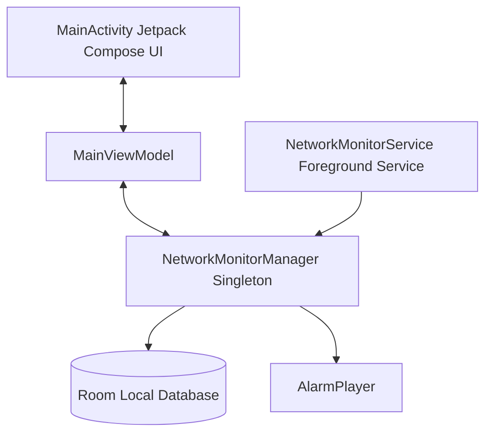

# 5G Guardian 🛡️

<p align="center">
  
</p>

<p align="center">
  <strong>Active fallback prevention & call awareness for Android</strong>
</p>

<p align="center">
  <a href="https://github.com/manikandan151113/5G-Guardian/releases"></a>
  <a href="https://www.gnu.org/licenses/gpl-3.0"></a>
  <a href="https://en.wikipedia.org/wiki/Free_and_open-source_software"></a>
  <a href="https://developer.android.com"></a>
</p>

---

## 📖 Description

**5G Guardian** is a lightweight, privacy-first, fully Free and Open Source Software (FOSS) utility for Android. It operates as a persistent background service that continuously tracks your active cellular network type and immediately alerts you if your connection drops or falls back from high-speed **5G** to **4G LTE, 3G, or 2G**. 

It is designed for remote workers, users with unlimited 5G data plans, and network enthusiasts who need to remain connected to stable 5G carriers or instantly know when they have migrated to restricted bands.

---

## 🎯 Key Features

- **Real-Time Network Telemetry**: Continuous, automated cellular carrier status checks (NR/5G, LTE/4G, 3G, 2G).
- **Persistent Background Monitoring**: Designed as a foreground service with low-resource usage, ensuring Android's OS doesn't kill the monitor during standby.
- **Smart Call-State Integration**: Intelligently silences continuous audio alarms when an active phone call is detected (incoming, outgoing, or active) and automatically resumes once the call ends.
- **Dual Alert Modes**:
  - 🚨 **Loud Alarm**: Plays a continuous, looping sound until manually dismissed.
  - 🔔 **Quiet Notify**: Plays a brief one-shot tone and sends a notification.
- **Custom Sound Explorer**: Select any system ringtone or browse and select **any local audio file** (MP3, WAV, OGG) from your device's filesystem.
- **Built-in Network Simulator**: Fully mock cellular state changes and phone call states to test and verify the app's responsiveness without leaving your desk.
- **100% Offline & Private**: Zero external network connections, zero trackers, zero telemetry, and zero ads.

---

## 📸 Screenshots

| Dashboard | Simulation Center | Alert Customization |
| --- | --- | --- |
| *[Screenshot Placeholder]* | *[Screenshot Placeholder]* | *[Screenshot Placeholder]* |

---

## ⚙️ Architecture & Technical Design

5G Guardian uses standard Android Jetpack and system architecture practices:



- **`MainActivity`**: Rendered with **Jetpack Compose** following **Material Design 3** patterns, offering dynamic colors, fluid layouts, and smooth transitions.
- **`NetworkMonitorService`**: A persistent background service run as a foreground service with a `mediaPlayback` type, enabling continuous audio feedback.
- **`NetworkMonitorManager`**: The core application state manager. Operates as an offline-first singleton using Kotlin Coroutines `StateFlow` to notify subscribers of cellular changes.
- **`AlarmPlayer`**: Orchestrates `MediaPlayer` (for custom URI sounds) and `ToneGenerator` (for synthetic warnings).

---

## 🛠️ Tech Stack & Dependencies

- **Programming Language**: Kotlin (`100%`)
- **UI Framework**: Jetpack Compose (Material Design 3)
- **Architecture**: MVVM with unidirectional data flow (UDF)
- **Local Persistence**: Room Database for historical logs
- **Asynchronous Flow**: Kotlin Coroutines & Flow API
- **Build System**: Gradle Kotlin DSL (`build.gradle.kts`)
- **Testing**: JUnit 4, Robolectric, and Roborazzi (screenshot verification)

---

## 📁 Repository Structure

```
5G-Guardian/
├── .github/
│   ├── ISSUE_TEMPLATE/       # GitHub issue configurations (YAML format)
│   └── workflows/            # CI/CD pipelines (Build, PR, Release)
├── app/
│   ├── src/
│   │   ├── main/
│   │   │   ├── java/com/fivegguardian/  # Kotlin source code package
│   │   │   ├── res/                     # UI resources, drawables, strings
│   │   │   └── AndroidManifest.xml      # Core manifest declaring permissions/components
│   │   └── test/                        # Local unit, Robolectric, and Screenshot tests
│   └── build.gradle.kts                 # Module-specific Gradle configuration
├── gradle/
│   └── libs.versions.toml               # Unified version catalog
├── build.gradle.kts                     # Top-level project build script
├── settings.gradle.kts                  # Project names and module mappings
└── LICENSE                              # GNU GPL v3.0 license copy
```

---

## ⚙️ Requirements & Installation

- **Minimum SDK**: Android 7.0 (API Level 24)
- **Target SDK**: Android 16 (API Level 36)
- **Network Support**: Device must have a cellular modem with 5G capabilities.

### Installation

1. Download the latest APK from the [Releases](https://github.com/manikandan151113/5G-Guardian/releases) page.
2. Enable "Install Unknown Apps" from your browser/file explorer settings if prompted.
3. Open the APK file and tap **Install**.

---

## 🛡️ Permissions Breakdown

To function correctly, the app requests the following permissions:
1. **`READ_PHONE_STATE`**: Allows the monitor to detect active calls to silence fallback alarms.
2. **`ACCESS_FINE_LOCATION` / `ACCESS_COARSE_LOCATION`**: Android requires location access to read cell-tower data and determine if the device is connected to a 5G NR network. *No location data is ever recorded or uploaded.*
3. **`FOREGROUND_SERVICE` / `FOREGROUND_SERVICE_MEDIA_PLAYBACK`**: Ensures the network listener runs uninterrupted in the background while playing warning alarms.
4. **`POST_NOTIFICATIONS`**: (Android 13+) Used to display the persistent service notification and alert status updates.

---

## 💻 Build Instructions

You can compile and build the APK locally from source.

### Setup
- Install Java Development Kit (JDK) 17 or higher.
- Ensure the Android SDK is configured on your machine.

### Build Commands
1. Clone the repository:
   ```bash
   git clone https://github.com/manikandan151113/5G-Guardian.git
   cd 5G-Guardian
   ```
2. Build the Debug APK:
   ```bash
   ./gradlew assembleDebug
   ```
3. Run Local Unit & Robolectric Tests:
   ```bash
   ./gradlew test
   ```
4. Build the Release APK:
   ```bash
   ./gradlew assembleRelease
   ```

---

## 🚀 Roadmap

- [ ] **Dual-SIM Support**: Track signal status across multiple active SIM cards.
- [ ] **Custom Vibration Patterns**: Define rhythmic haptic feedbacks for fallback events.
- [ ] **Signal Strength (RSRP/RSRQ) Logging**: Track detailed quality parameters alongside bands.
- [ ] **F-Droid Main Repository Release**: Officially publish to the F-Droid Catalog.

---

## 🤝 Contributing

Contributions are welcome! Please read our [Contributing Guide](CONTRIBUTING.md) and [Code of Conduct](CODE_OF_CONDUCT.md) for instructions on submitting bug fixes or feature additions.

---

## ❓ FAQ

**Q: Why does the app require my location?**
**A**: Android's security design binds network cell-tower identifiers (necessary to differentiate 5G from 4G) to Location Services. The app only accesses location locally to retrieve cell data and does not track, save, or transmit your coordinates.

**Q: Can I run this without GMS (Google Mobile Services)?**
**A**: Yes! The app has zero dependencies on Google Play Services or Firebase, making it fully functional on clean AOSP and de-googled ROMs (e.g., GrapheneOS, LineageOS).

**Q: How do I silence a running alarm?**
**A**: You can silence the alarm by tapping the "Stop Alarm" action button directly in the active notification, or by opening the app and tapping "Stop Alarm".

---

## 📄 License & Credits

- Licensed under the **GNU General Public License v3.0** (see [LICENSE](LICENSE) for details).
- Logo & icons styled using standard Google Material Icons.
